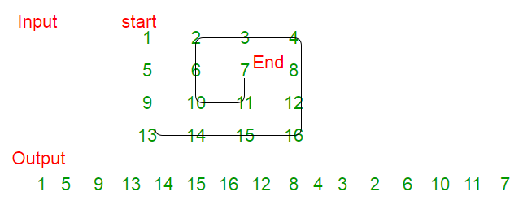

## От миналите таскове:
## Task 3 - Умножаване на матрици (multiply)

По дадени две матрици, определете дали могат да се умножат, и ако могат - изведете резултата. Матриците са най-много 100 х 100.

**Вход:** Получават се две числа A и B - съответно редовете и колоните на първата матрица. Следват A реда с по B числа - елементите на матрицата.

Следват още две числа - C и D - съответно редовете и колоните на втората матрица. Следват C реда с по D числа - елементите на втората матрица.

**Изход:** NO ако не могат да се умножат и YES и матрицата, ако могат да се умножат.

**Пример:**
**Вход:**
	
	2 3
	1 2 3
	4 5 6
	
	3 4
	7 8 9 10
	20 30 40 50
	60 70 80 90
	
**Изход:**

	YES
	227 278 329 380 
	488 602 716 830
	
-----------------------------
 

## За всички задачи ползвате функциите fillMatrix/printMatrix, които написахме в час.
### Съвет: напишете си ги наново, а не ги copy-paste-вайте, за да ги затвърдите :)

 

## Task 1 - Counter-clockwise 
 

Обходете въведена <b>квадратна</b> матрица обратно на часовниковата стрелка и принтирайте елементите на матрицата в този ред.

Пример:

 &nbsp;&nbsp;&nbsp;&nbsp;&nbsp;&nbsp;&nbsp;&nbsp;&nbsp;&nbsp;&nbsp;&nbsp;&nbsp;&nbsp;&nbsp;&nbsp;&nbsp;&nbsp;&nbsp;&nbsp;&nbsp;&nbsp;&nbsp;&nbsp;&nbsp;&nbsp;&nbsp;&nbsp;&nbsp;&nbsp;&nbsp;&nbsp;

 

## Task 2 - Подмножество
 

Дадени са два едномерни масива с естествени числа от интервала (0..1000). Да се напише функция, която проверява дали първият масив е подмножество на втория. Въвеждате двата масива последователно (помислете кой трябва да е първия въведен). Първият масив не трябва да съдържа повтарящи се числа.

Пример: 

### Input

Подмножество: 2,1,5,4,6

Множество: <b>1,2,3,4,5,6</b>,7,18,7,11

### Output

Yes, it is a subset

 

## Task 3 - Rotation
 

По въведена <b>квадратна</b> матрица направете ротация на 90 градуса в посока на часовниковата стрелка. За оптимистите - нямате право да ползвате нова матрица за запазване на резултата - модифицирате само оригиналната (тоест не натоварвате паметта с още една матрица :)

Вход:

1 2 3 

4 5 6

7 8 9  

Изход:

7 4 1 

8 5 2

9 6 3